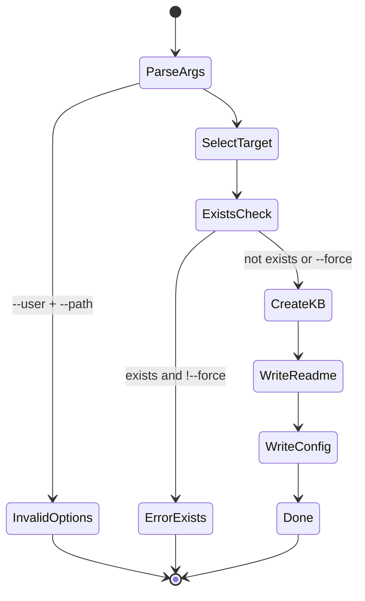
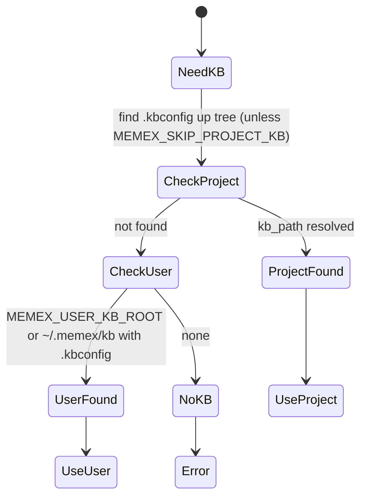
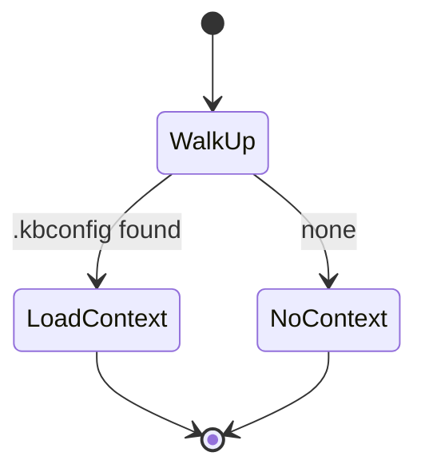
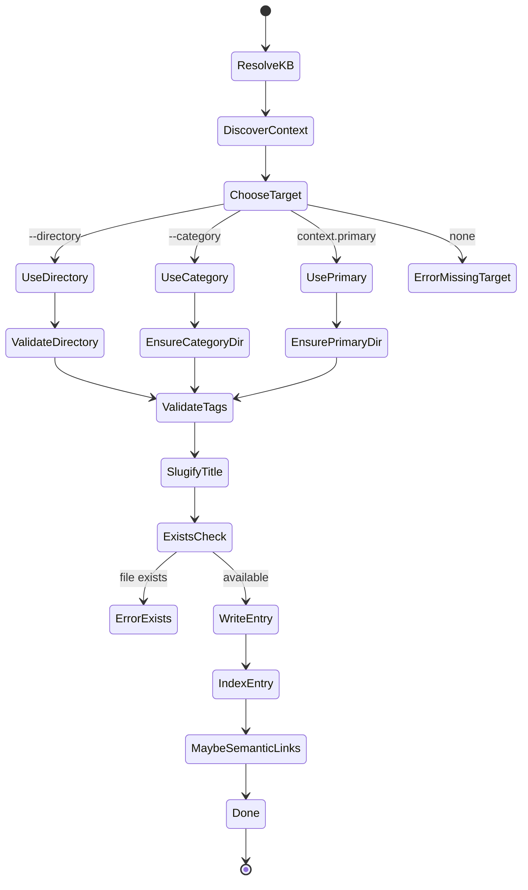
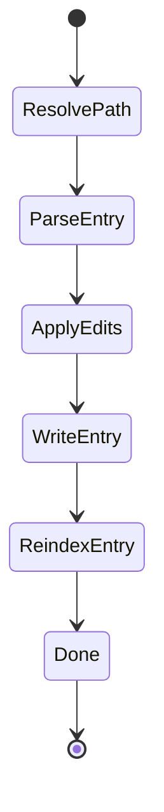
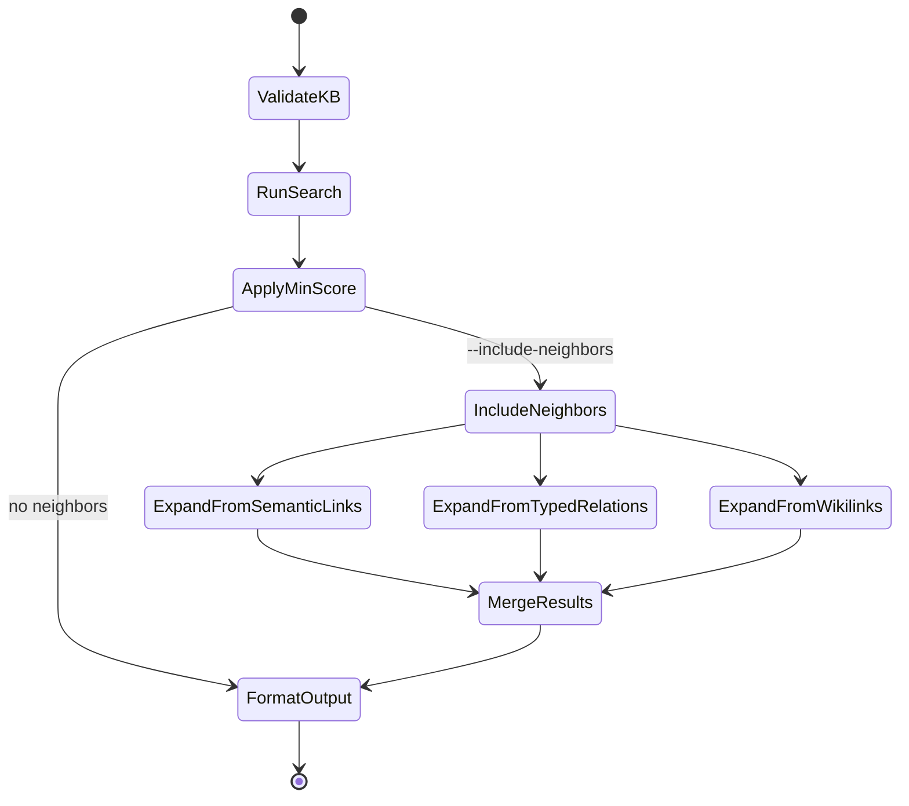
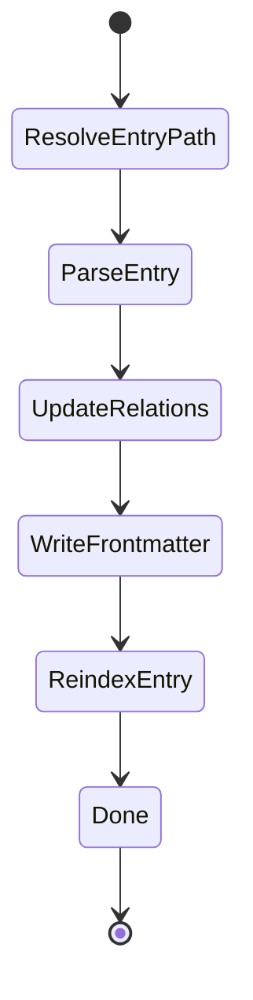
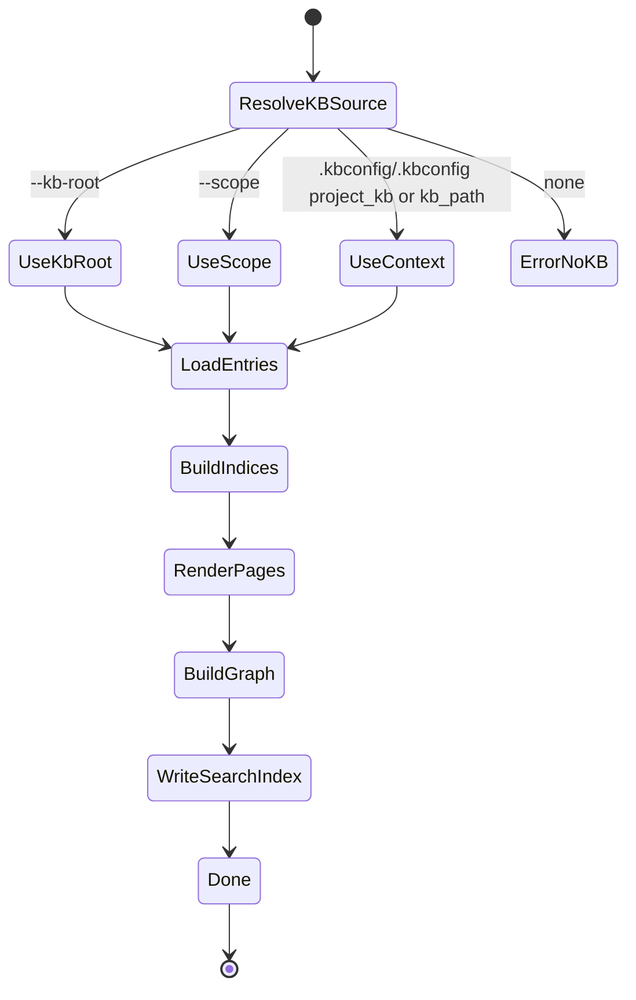

# MX State Diagrams

These diagrams capture the primary MX 0.2.0 user journeys and the key states that
govern behavior across CLI, storage, and publishing.

## Init and KB Discovery

### mx init (project or user scope)

Notes:
- Project scope writes `.kbconfig` at the repo root with `kb_path`.
- User scope writes `.kbconfig` inside `~/.memex/kb/`.

### KB discovery (reads) + context overlays

Notes:
- Context overlays supply `primary`, `boost_paths`, `default_tags`, and `publish_base_url`.

## Add, Update, Patch

### mx add (create entry)

Notes:
- `--category` (or `--directory`) is required unless `primary` is set in `.kbconfig`.
- Writes rebuild backlinks and reindex the new entry.

### mx replace / patch / append (update entry)

Notes:
- Paths accept `@project/` and `@user/` prefixes.
- Edits update frontmatter metadata and reindex the entry.

## Search + Neighbors (Relations Graph)

Notes:
- `--scope` limits the KB roots used for indexing and search; single-KB mode returns unscoped paths.
- Neighbor expansion uses semantic links, typed relations, and wikilinks.

## Typed Relations + Publish Rendering

### mx relations-add / relations-remove

### mx publish

Notes:
- Typed relation targets are normalized per-scope; cross-scope targets are skipped during publish.
- Publish outputs HTML pages, tag indexes, search index, and graph data.
