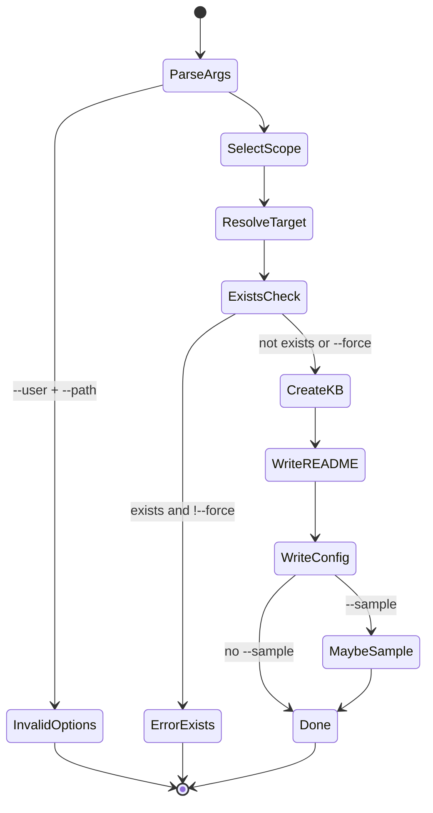
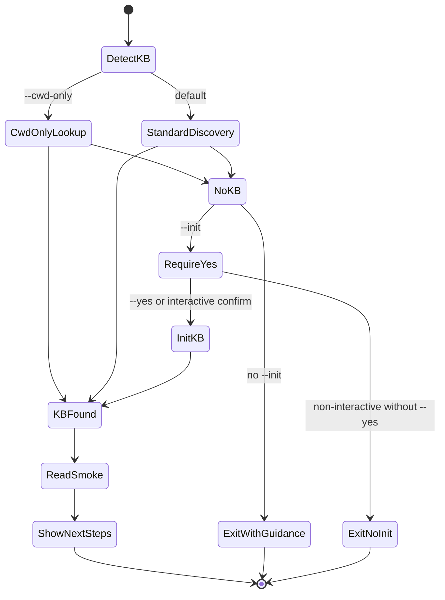
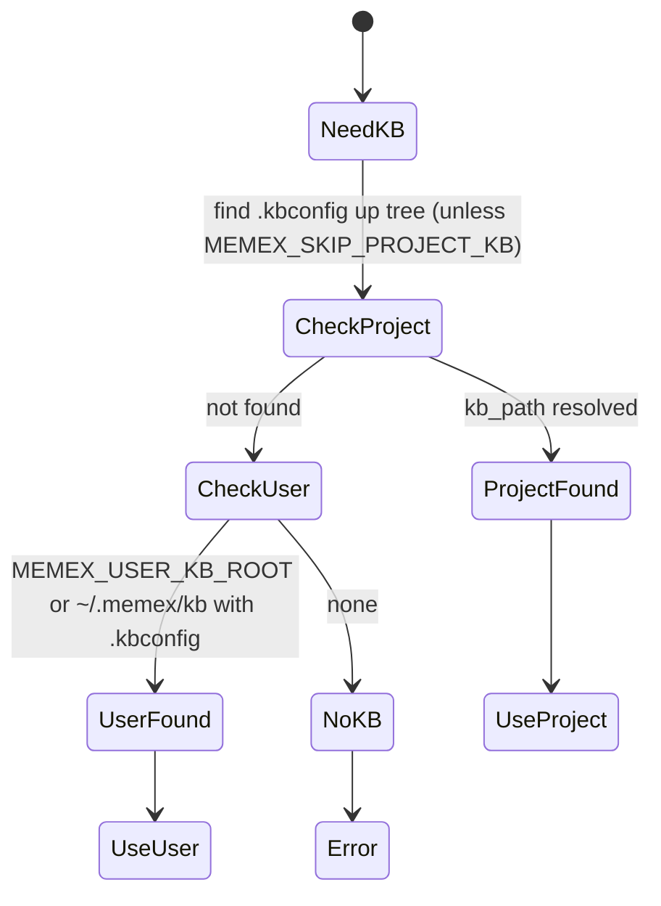
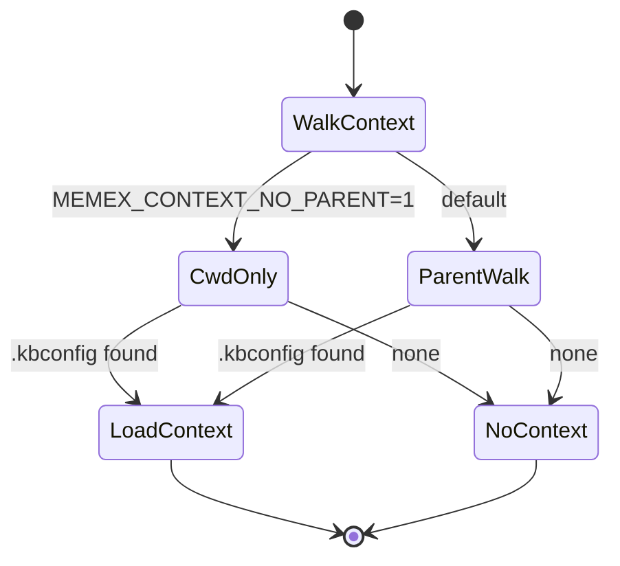
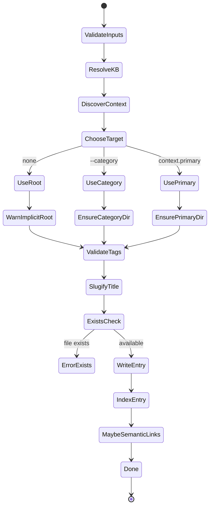
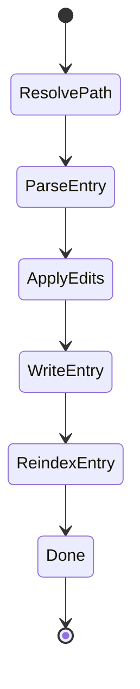
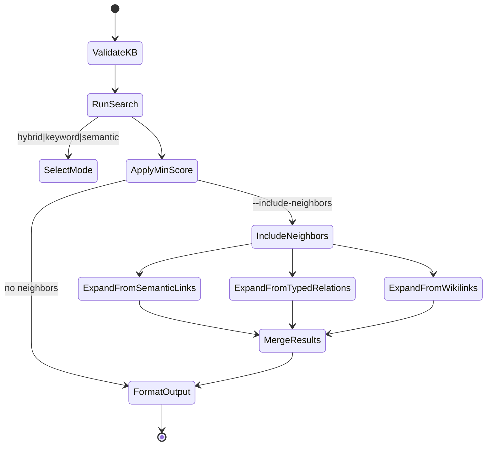
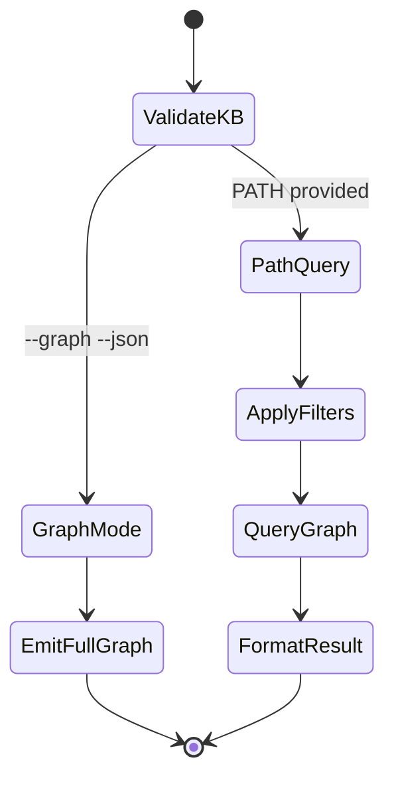
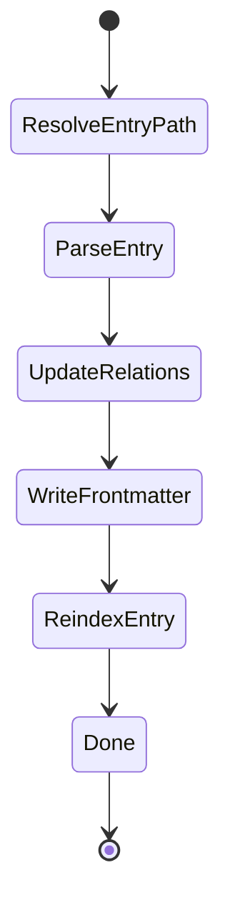
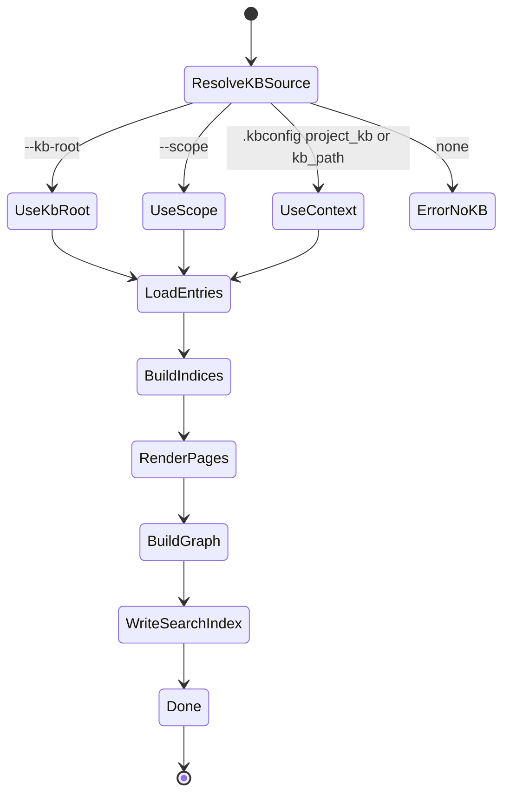

# MX State Diagrams

These diagrams capture the current shipped `mx` user journeys and key states across
CLI, discovery, indexing, relations, and publishing.

## Init and KB Discovery

### mx init (project or user scope)

```mermaid
stateDiagram-v2
    [*] --> ParseArgs
    ParseArgs --> InvalidOptions: --user + --path
    InvalidOptions --> [*]
    ParseArgs --> SelectScope
    SelectScope --> ResolveTarget
    ResolveTarget --> ExistsCheck
    ExistsCheck --> ErrorExists: exists and !--force
    ErrorExists --> [*]
    ExistsCheck --> CreateKB: not exists or --force
    CreateKB --> WriteREADME
    WriteREADME --> WriteConfig
    WriteConfig --> MaybeSample: --sample
    WriteConfig --> Done: no --sample
    MaybeSample --> Done
    Done --> [*]
```

Notes:
- Default scope is `project` (creates `./kb` and writes `.kbconfig` in repo context).
- `--user` creates `~/.memex/kb`; `--path` sets a custom project KB location.
- `.kbconfig` supports `project_kb` (with `kb_path` compatibility).

### mx onboard (first-run guardrail + optional init)

```mermaid
stateDiagram-v2
    [*] --> DetectKB
    DetectKB --> CwdOnlyLookup: --cwd-only
    DetectKB --> StandardDiscovery: default
    CwdOnlyLookup --> KBFound
    CwdOnlyLookup --> NoKB
    StandardDiscovery --> KBFound
    StandardDiscovery --> NoKB
    NoKB --> ExitWithGuidance: no --init
    NoKB --> RequireYes: --init
    RequireYes --> InitKB: --yes or interactive confirm
    RequireYes --> ExitNoInit: non-interactive without --yes
    InitKB --> KBFound
    KBFound --> ReadSmoke
    ReadSmoke --> ShowNextSteps
    ShowNextSteps --> [*]
    ExitWithGuidance --> [*]
    ExitNoInit --> [*]
```

### KB discovery (reads) + context overlays

```mermaid
stateDiagram-v2
    [*] --> NeedKB
    NeedKB --> CheckProject: find .kbconfig up tree (unless MEMEX_SKIP_PROJECT_KB)
    CheckProject --> ProjectFound: kb_path resolved
    CheckProject --> CheckUser: not found
    CheckUser --> UserFound: MEMEX_USER_KB_ROOT or ~/.memex/kb with .kbconfig
    CheckUser --> NoKB: none
    ProjectFound --> UseProject
    UserFound --> UseUser
    NoKB --> Error
```

```mermaid
stateDiagram-v2
    [*] --> WalkContext
    WalkContext --> CwdOnly: MEMEX_CONTEXT_NO_PARENT=1
    WalkContext --> ParentWalk: default
    CwdOnly --> LoadContext: .kbconfig found
    CwdOnly --> NoContext: none
    ParentWalk --> LoadContext: .kbconfig found
    ParentWalk --> NoContext: none
    LoadContext --> [*]
    NoContext --> [*]
```

Notes:
- Discovery order for KB roots is project first, then user KB.
- Context overlays can supply `primary`, `default_tags`, `boost_paths`, `publish_base_url`,
  and `publish_index_entry`.

## Add, Update, Patch

### mx add (create entry)

```mermaid
stateDiagram-v2
    [*] --> ValidateInputs
    ValidateInputs --> ResolveKB
    ResolveKB --> DiscoverContext
    DiscoverContext --> ChooseTarget
    ChooseTarget --> UseCategory: --category
    ChooseTarget --> UsePrimary: context.primary
    ChooseTarget --> UseRoot: none
    UseCategory --> EnsureCategoryDir
    UsePrimary --> EnsurePrimaryDir
    UseRoot --> WarnImplicitRoot
    WarnImplicitRoot --> ValidateTags
    EnsureCategoryDir --> ValidateTags
    EnsurePrimaryDir --> ValidateTags
    ValidateTags --> SlugifyTitle
    SlugifyTitle --> ExistsCheck
    ExistsCheck --> ErrorExists: file exists
    ExistsCheck --> WriteEntry: available
    WriteEntry --> IndexEntry
    IndexEntry --> MaybeSemanticLinks
    MaybeSemanticLinks --> Done
    Done --> [*]
```

Notes:
- Exactly one content source is required: `--content`, `--file`, or `--stdin`.
- If no `--category` and no `primary`, `mx add` writes to KB root and warns by default.
- `--scope` can pin writes to `project` or `user`; otherwise scope is auto-resolved.

### mx replace / patch / append (update entry)

```mermaid
stateDiagram-v2
    [*] --> ResolvePath
    ResolvePath --> ParseEntry
    ParseEntry --> ApplyEdits
    ApplyEdits --> WriteEntry
    WriteEntry --> ReindexEntry
    ReindexEntry --> Done
    Done --> [*]
```

Notes:
- Paths accept `@project/` and `@user/` prefixes.
- Edits update frontmatter metadata and reindex the entry.

## Search + Neighbors (Relations Graph)

```mermaid
stateDiagram-v2
    [*] --> ValidateKB
    ValidateKB --> RunSearch
    RunSearch --> SelectMode: hybrid|keyword|semantic
    RunSearch --> ApplyMinScore
    ApplyMinScore --> IncludeNeighbors: --include-neighbors
    ApplyMinScore --> FormatOutput: no neighbors
    IncludeNeighbors --> ExpandFromSemanticLinks
    IncludeNeighbors --> ExpandFromTypedRelations
    IncludeNeighbors --> ExpandFromWikilinks
    ExpandFromSemanticLinks --> MergeResults
    ExpandFromTypedRelations --> MergeResults
    ExpandFromWikilinks --> MergeResults
    MergeResults --> FormatOutput
    FormatOutput --> [*]
```

Notes:
- `--scope` limits search to one KB root (`project` or `user`).
- Neighbor expansion traverses semantic links, typed relations, and wikilinks.
- `--neighbor-depth` controls hop count (1-5); `--strict` disables semantic fallback.

## Typed Relations + Publish Rendering

### mx relations (query graph)

```mermaid
stateDiagram-v2
    [*] --> ValidateKB
    ValidateKB --> GraphMode: --graph --json
    ValidateKB --> PathQuery: PATH provided
    GraphMode --> EmitFullGraph
    PathQuery --> ApplyFilters
    ApplyFilters --> QueryGraph
    QueryGraph --> FormatResult
    EmitFullGraph --> [*]
    FormatResult --> [*]
```

### mx relations-add / mx relations-remove

```mermaid
stateDiagram-v2
    [*] --> ResolveEntryPath
    ResolveEntryPath --> ParseEntry
    ParseEntry --> UpdateRelations
    UpdateRelations --> WriteFrontmatter
    WriteFrontmatter --> ReindexEntry
    ReindexEntry --> Done
    Done --> [*]
```

### mx publish

```mermaid
stateDiagram-v2
    [*] --> ResolveKBSource
    ResolveKBSource --> UseKbRoot: --kb-root
    ResolveKBSource --> UseScope: --scope
    ResolveKBSource --> UseContext: .kbconfig project_kb or kb_path
    ResolveKBSource --> ErrorNoKB: none
    UseKbRoot --> LoadEntries
    UseScope --> LoadEntries
    UseContext --> LoadEntries
    LoadEntries --> BuildIndices
    BuildIndices --> RenderPages
    RenderPages --> BuildGraph
    BuildGraph --> WriteSearchIndex
    WriteSearchIndex --> Done
    Done --> [*]
```

Notes:
- Source resolution precedence:
  `--kb-root` -> `--scope` -> `.kbconfig project_kb`.
- Base URL precedence:
  `--base-url` -> `.kbconfig publish_base_url`.
- Landing page precedence:
  `--index` -> `.kbconfig publish_index_entry`.
- `--scope=user` triggers a confirmation prompt unless `--yes` is provided.
- Publish writes rendered pages plus tag/search/graph artifacts and supports draft/archive controls.
